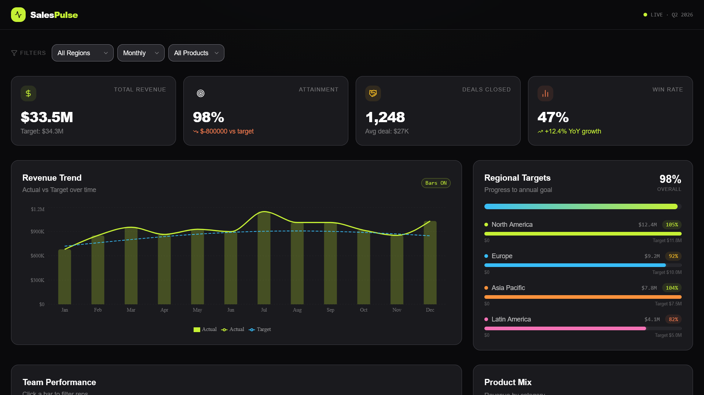

# Sales Analytics Dashboard

[](https://reactjs.org/)
[](https://tailwindcss.com/)
[](https://recharts.org/)
[](https://lucide.dev/)

Interactive sales analytics dashboard built with **React 19**, **Tailwind CSS v4**, **Lucide React** icons, and **Recharts**. Features region/team filtering, performance metrics, monthly trends, KPI cards, and dynamic data visualization.


**[Click here to view the live demo →](https://sales-dashboard-nine-plum.vercel.app)**
---

## ✨ Features

- **📍 Hierarchical Filtering** – Regions → Teams → Salespeople cascading filters
- **📊 Interactive Charts** – Line charts for monthly trends, pie charts for product mix
- **🎯 Performance Tracking** – Actual vs target metrics with visual indicators
- **👥 Team & Rep Views** – Drill down into team performance and individual reps
- **📈 KPI Dashboard** – Revenue, deals, win rates, average deal size, growth %
- **🎨 Modern UI** – Dark theme with glow effects, smooth animations, responsive design
- **📱 Fully Responsive** – Works on desktop, tablet, and mobile devices

---

## 🛠️ Tech Stack

| Technology | Purpose |
|------------|---------|
| **React 19** | UI framework |
| **Tailwind CSS v4** | Styling & theming |
| **Lucide React** | Icon library |
| **Recharts** | Charting library |
| **Vite** | Build tool |

---

## 🚀 Getting Started

### Prerequisites

- Node.js (v18 or higher)
- npm / yarn / pnpm

### Installation

```bash
# Clone the repository
git clone https://github.com/Ankitzoro/Sales-Dashboard.git
cd sales-analytics-dashboard

# Install dependencies
npm install

# Start development server
npm run dev
